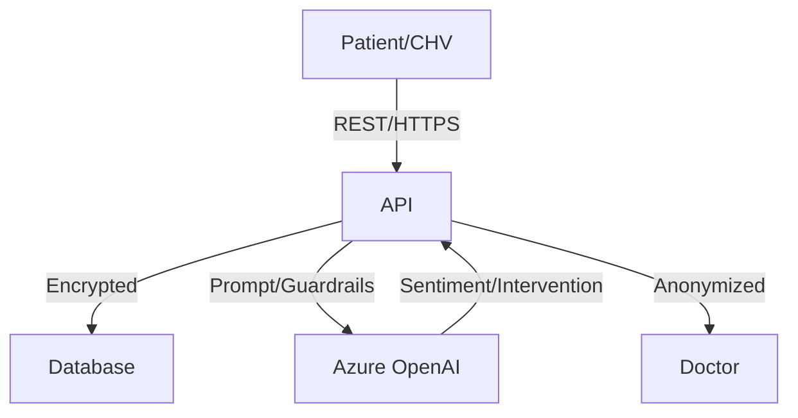

<div align="center">

# 🧭 NepMED: Mental Health Platform
### AI Mental Health Copilot & Anonymous Care Pipeline

<p align="center">
  
  
  
  
  
</p>

**Built for the Nepal-US Hackathon 2026** 🏆  
*Bridging the gap between mental health stigma and professional care through AI, anonymity, and community.*

</div>

---

## 📸 Product Screenshots

> A walkthrough of the Mental Compass experience — from onboarding to clinical insights.

### 🔐 Onboarding & Secure Access

<table>
  <tr>
    <td align="center" width="50%">
      
      <br />
      <sub><b>🔑 Login Screen</b></sub>
      <br />
      <sub>Secure JWT-based authentication with role-aware routing. Clean, minimal UI designed for distressed users.</sub>
    </td>
    <td align="center" width="50%">
      
      <br />
      <sub><b>🏠 Patient Dashboard</b></sub>
      <br />
      <sub>Personalized analytics hub showing mood trends, streak tracking, and quick-action shortcuts.</sub>
    </td>
  </tr>
</table>

---

### 📓 Core Patient Experience

<table>
  <tr>
    <td align="center" width="33%">
      
      <br />
      <sub><b>✍️ Journaling</b></sub>
      <br />
      <sub>Text, voice & wearable journal entries powered by AI sentiment analysis. Anonymous by default.</sub>
    </td>
    <td align="center" width="33%">
      
      <br />
      <sub><b>🌱 Early Support Tools</b></sub>
      <br />
      <sub>CBT reframing, 4-4-4 breathing, and 5-4-3-2-1 grounding — AI-curated, never diagnostic.</sub>
    </td>
    <td align="center" width="33%">
      
      <br />
      <sub><b>🩺 Doctor Consultation</b></sub>
      <br />
      <sub>Seamless booking flow with full patient anonymity preserved. Doctors see only <code>JRN-XXXX</code> IDs.</sub>
    </td>
  </tr>
</table>

---

### 📊 Clinical Assessment Tools

<table>
  <tr>
    <td align="center" width="50%">
      
      <br />
      <sub><b>📉 PHQ-9 Depression Screening</b></sub>
      <br />
      <sub>Standardized 9-item questionnaire mapped to severity scores. Used by doctors for triage prioritization.</sub>
    </td>
    <td align="center" width="50%">
      
      <br />
      <sub><b>😰 GAD-7 Anxiety Index</b></sub>
      <br />
      <sub>Generalized Anxiety Disorder 7-item scale for quantified clinical risk scoring and escalation routing.</sub>
    </td>
  </tr>
</table>

---

### 🌐 Community, Scheduling & Learning

<table>
  <tr>
    <td align="center" width="33%">
      
      <br />
      <sub><b>👥 Anonymous Community</b></sub>
      <br />
      <sub>Peer support forum where users share experiences without revealing identities — safe expression at scale.</sub>
    </td>
    <td align="center" width="33%">
      
      <br />
      <sub><b>📅 Sync & Schedule</b></sub>
      <br />
      <sub>FCHV-managed check-in scheduling and calendar sync. Enables proxy care for rural, offline populations.</sub>
    </td>
    <td align="center" width="33%">
      
      <br />
      <sub><b>🎧 Learning & Podcasts</b></sub>
      <br />
      <sub>Curated mental wellness content, expert podcasts, and guided exercises surfaced by AI context.</sub>
    </td>
  </tr>
</table>

---

## 💡 The Problem

Mental health crises among students and professionals are at an all-time high due to career pressure, exam burnout, and financial uncertainty. However, in many communities (especially in South Asia), **stigma** prevents individuals from seeking help. 
- People are afraid of being labeled.
- Access to certified psychologists is limited outside urban centers.
- Rural areas lack internet infrastructure, leaving localized communities behind.
- Existing tools diagnose unethically, violating user trust.

## 🚀 The Solution: Mental Compass

**Mental Compass** is a journaling-first platform with a secure, **anonymous pipeline** connecting patients, doctors, and Female Community Health Volunteers (FCHVs). 

1. **Users Journal Freely:** Users log feelings via text, voice, or wearables.
2. **AI Acts as a Copilot, Not a Doctor:** Our Azure OpenAI agent provides gentle habit suggestions (breathing, CBT reframing, grounding)—*it never diagnoses*.
3. **True Anonymity:** Doctors review data through proxy IDs (`JRN-XXXX`). They can assess the aggregated data and offer care without ever knowing the patient's real name.
4. **Community Power:** FCHVs act as "Mini Admins" in low-bandwidth areas, capturing check-ins manually for those without smartphone access.

---

## ✨ Why Mental Compass Wins

### 1. 🛡️ The "Zero-Trust" Anonymous Pipeline
Patients are assigned anonymous IDs (`JRN-XXXX`). Doctors pay a subscription to access the platform. When a doctor reviews a journal, they rate the symptoms and provide notes—while the patient remains 100% anonymous until *they* consent to a consultation.

### 2. 🧠 Ethical AI (The Anti-Diagnosis Engine)
Most "AI mental health" apps try to play doctor. Mental Compass uses AI strictly to:
- Detect decline patterns over a 30-day window.
- Suggest somatic interventions (4-4-4 breathing, 5-4-3-2-1 grounding, CBT thought reframing).
- Ask gently: *"Would you like to meet a doctor?"*

### 3. 👩‍⚕️ FCHV / CHV Proxy Capture
We digitize the doorstep. Community Health Volunteers can create accounts, log data, and manage schedules *on behalf* of rural patients who do not own smartphones, bridging the rural-urban digital divide.

### 4. 🎛️ Dynamic UI Modes (Cognitive Load Management)
- **Calm Mode:** Minimal constraints, reduced stimulation, and soft branding designed for users in active distress (WHO-aligned).
- **Full Mode:** Advanced analytics, triage metrics, and specialized graphs for clinicians and researchers.

---

## 🛠️ Features Breakdown

### Role-Based Access Control (RBAC)
- 🛡️ **Super Admin** — Full system access, data governance.
- 🩺 **Doctor** — Accesses anonymized journals, scores risk, manages a priority queue.
- 🧑 **Patient** — Habit building, journaling, analytics, secure consultations.
- 👨‍👩‍👧 **Guardian** — Read-only emergency monitoring & safety-net linking.
- 👩‍⚕️ **FCHV (Volunteer)** — Proxy data entry for unconnected populations.

### Intervention Toolkits (Fully Interactive)
- **5-4-3-2-1 Grounding:** Guided sensory reality anchoring.
- **CBT Thought Reframe:** Worry to evidence-based balanced thinking.
- **4-4-4 Breathing:** Visual breathing metronome. 

### Risk & Escalation Engine
- **Decline Detection:** Monitors text/voice sentiment shifts.
- **SOS Escalation:** Immediate 1-click distress path with automatic routing to Care Team / Guardians.

---

## 🏗️ Architecture & Tech Stack



**Frontend:**
- **Web:** Vanilla JS, HTML5, CSS3 Custom Properties (No bloat, blazing fast).
- **Mobile (Ready):** React Native + Expo SDK 51.
- **Design:** WCAG 2.2 AA compliant, fluid responsive scaling, modular components.

**Backend:**
- **Server:** Node.js + Express (ES Modules).
- **AI:** Azure OpenAI integration (Sentiment, entity extraction).
- **Identity:** JWT authentication + Bcrypt hashing.
- **Data:** Local JSON persistence (easily scalable to Postgres/MongoDB).

---

## 🤝 Social & Business Impact

**The Business Model:**
- **Doctors Pay:** Subscription fee to access anonymized queues and build their digital practice.
- **Patients Enjoy for Free:** Journaling and AI tools are forever free. They only pay standard consultation rates if they *choose* to book a doctor.
- **B2B / B2G:** Licensing the FCHV proxy system to government health bodies and INGOs.

---

## 💻 Quick Start & Demo


### Prerequisites
- Node.js 18+
- npm 9+
- Azure OpenAI endpoint, API key, and deployment name

### 1) Backend + Web

```bash
cd backend
copy .env.example .env   # or: cp .env.example .env
npm install
npm run dev
```

Backend runs on `http://localhost:4000` and serves the web app from the same origin.

LLM provider configuration in `.env`:
- Azure OpenAI (primary LLM provider):
  - `AZURE_OPENAI_ENDPOINT`
  - `AZURE_OPENAI_API_KEY`
  - `AZURE_OPENAI_DEPLOYMENT`
  - `AZURE_OPENAI_API_VERSION` (default `2024-10-21`)

### Default Super Admin Credentials
| Field | Value |
|-------|-------|
| Email | `admin@aegisspeak.com` |
| Password | `AegisAdmin@2026` |

### 3) Seed Initial Data (optional)

```bash
pip install requests
python3 scripts/seed_demo.py
```

This creates 5 patients, 2 doctors, 1 CHV, 50+ journal entries, and doctor assessments.

### 2) Mobile (Expo)

```bash
cd frontend
npm install
npx expo start
```

Then press:
- `i` for iOS simulator
- `a` for Android emulator
- `w` for web preview

---

## API Endpoints

### Public
| Method | Path | Description |
|--------|------|-------------|
| GET | `/health` | Health check |

### Authentication
| Method | Path | Description |
|--------|------|-------------|
| POST | `/api/auth/login` | Login (returns JWT + user) |
| GET | `/api/auth/me` | Get current user profile (auth required) |

### IAM (Super Admin only)
| Method | Path | Description |
|--------|------|-------------|
| POST | `/api/iam/users` | Create user |
| GET | `/api/iam/users` | List all users (filter by `?role=`) |
| GET | `/api/iam/users/:userId` | Get user by ID |
| PUT | `/api/iam/users/:userId` | Update user |
| DELETE | `/api/iam/users/:userId` | Delete user |
| GET | `/api/iam/patients/:patientId/guardians` | List guardians for patient |
| GET | `/api/iam/my-patient` | Guardian: get linked patient |

### Core Features
| Method | Path | Description |
|--------|------|-------------|
| POST | `/api/checkins` | Submit daily check-in |
| POST | `/api/chat` | AI copilot chat |
| POST | `/api/journal/analyze` | Journal sentiment analysis |
| GET | `/api/users/:userId/trends` | Mood trends |
| GET | `/api/users/:userId/records` | Check-in records |
| GET | `/api/users/:userId/insights` | Predictive insights |
| POST | `/api/transport/sms` | SMS/USSD fallback |
| POST | `/api/escalations` | Create escalation |
| GET | `/api/users/:userId/escalations` | List escalations |

### Journaling (Patient only)
| Method | Path | Description |
|--------|------|-------------|
| POST | `/api/journals` | Create journal entry (text/voice/wearable) → returns AI suggestions |
| GET | `/api/journals/mine` | Get own journals + stats + consultation suggestion |
| POST | `/api/journals/decline-consult` | Decline doctor consultation (reason tracked) |

### Doctor (Anonymized Reader)
| Method | Path | Description |
|--------|------|-------------|
| GET | `/api/doctor/queue` | Get queue of anonymous patient IDs with journal counts |
| GET | `/api/doctor/journals/:anonymousId` | Read journals for an anonymous ID (NO real identity) |
| POST | `/api/doctor/assess/:entryId` | Submit assessment (depression, stress, anxiety scores) |

### CHV (Community Health Volunteer)
| Method | Path | Description |
|--------|------|-------------|
| POST | `/api/chv/create-patient` | Create patient account (Mini Admin privilege, optional initial intake note) |
| GET | `/api/chv/my-patients` | List patients created by this CHV |
| PUT | `/api/chv/patients/:patientId` | Update managed patient profile + check-in schedule on behalf |
| POST | `/api/chv/patients/:patientId/journals` | Submit journal entry on behalf of managed patient |
| POST | `/api/chv/patients/:patientId/checkins` | Submit check-in on behalf of managed patient |

Notes:
- CHV/FCHV can manage only patients they created.
- Super Admin can use the same CHV endpoints across all patients.

---

## UX Modes (Web)

- **Calm mode** (default):
  - Reduced interface complexity and lower stimulation.
  - Safer default for distressed users.
  - WHO-aligned cognitive load management.
  - Animations disabled, subtler visual effects.

- **Full mode**:
  - Access to advanced analytics, triage, alerts, and compliance views.
  - Voice Lab, Signals, Screening, and Insights screens.
  - Full clinician workflows and data export.

---

## User Roles & Access Matrix

| Feature | 🛡️ Admin | 🩺 Doctor | 🧑 Patient | 👨‍👩‍👧 Guardian | 👩‍⚕️ CHV |
|---------|----------|----------|-----------|-----------|---------|
| IAM User Management | ✅ | ❌ | ❌ | ❌ | Patients only |
| Journaling | ✅ | ❌ | ✅ (own) | ❌ | ✅ (on behalf of managed patients) |
| Anonymous Journal Reader | ✅ | ✅ (by ID) | ❌ | ❌ | ❌ |
| Doctor Assessments | ✅ | ✅ | ❌ | ❌ | ❌ |
| AI Suggestions | ✅ | ❌ | ✅ (auto) | ❌ | ❌ |
| Counseling Services | ✅ | ✅ | ✅ | ✅ | ✅ |
| Patient Records | ✅ | Anonymous only | Own only | Linked only | Created/managed only |
| Emergency Escalation | ✅ | ✅ | ✅ | ✅ | ✅ |
| Screening (door-to-door) | ✅ | ❌ | ❌ | ❌ | ✅ |
| Compliance & Audit | ✅ | View only | ❌ | ❌ | ❌ |

### FCHV-Focused Web UX

- FCHV sees only FCHV-relevant navigation and screens.
- Hidden from FCHV UI: doctor dashboard/journal/care operations, patient self-service screens, guardian screens, and admin-only surfaces.
- Exposed to FCHV UI:
  - Register new patient
  - View/select managed patients
  - Update patient profile and check-in schedule on behalf
  - Save proxy journal entry
  - Submit proxy check-in

---

## 👥 Team: Mental Compass

**Product:** NepMED: Mental Health Platform

**Team Members:**
- Abiral Adhikari
- Reewaj Khanal
- Samikshya Upadaya
- Samir Wagle
- Shayana Tiwari

---

## Hackathon Value

Mental Compass is built for low-resource, stigma-sensitive contexts:
- 📝 **Journaling-first** — no clinical language, just daily reflections
- 🔒 **Anonymous pipeline** — doctors never see patient names, only `JRN-XXXX` IDs
- 🤖 **AI never diagnoses** — only suggests music, articles, exercises, breathing
- 👩‍⚕️ **CHV integration** — digitalized door-to-door screening (FCHV model)
- 🌐 Multilingual support (English, Nepali, Hindi paths)
- 📶 Offline-friendly workflows
- 📲 SMS/USSD fallback support
- 🔐 Privacy-first, clinician-aware architecture
- ♿ WCAG 2.2 AA accessible
- 🏥 MIT Health–inspired free counseling services

<p align="center">
  <strong>Built for Nepal-US Hackathon 2026</strong><br/>
  <em>Mental health support that is early, private, and actionable.</em>
</p>

